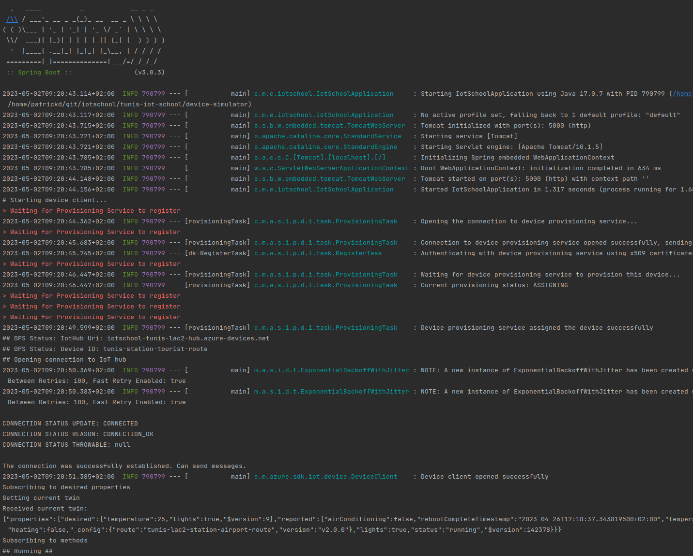

# Big Picture
To show interactions between IoT Devices and a Backend that controls them, there are 2 applications in here
* `device-simulator`: simulates an air conditioning unit with iot capability
* `backend-app`: is a backend application that allows operators to communicate with multiple air conditioning devices

In this exercise you will start 2 simulated devices, and 1 backend app that connect to azure like this
```
ac-front      ===================>   |-----------------| =======> |--------------------|
                                     |      *DPS*      |          |                    |
ac-back       ===================>   |     Device      | =======> |     *IoT Hub*      |
                                     |   Provisioning  |          |                    |
                                     |     Service     |          |                    |
                                     |-----------------|          |                    |
                                                                  |                    |
                                                                  |                    |
backend-app   ================================================>   |____________________|
```

The following sections cover more details about the Azure IoT Setup in general and the setup we already provide as well
as the tasks left as exercises to you.

# Details

## Azure IoT Setup
As shown in the picture above, there are 2 Azure IoT components involved in the setup of our air conditioning units.

The Device Provisioning Service (DPS) acts as a gateway or router that redirects devices to their assigned IoT Hub.  
https://learn.microsoft.com/en-us/azure/iot-dps/about-iot-dps

The IoT Hub is an MQTT Broker that the device will connect to in order to send and receive data.
https://learn.microsoft.com/en-us/azure/iot-hub/iot-concepts-and-iot-hub

## Device Simulator
As connected iot devices, we will simulate an air conditioning unit, that is retro fitted into a metro train.  
The device will periodically send its status, including
* current time
* lights
* temperature
* whether it is heating or cooling at the moment
* position of the train

For this we have prepared a java application that connects to IoT Hub via the DPS.  
It then runs a loop where executes the Tasks from above, then sleeps for 1s and repeats.

To establish a proper connection with the DPS and be assigned to your IoT Hub, 
you need to create a certificate file and store it in the resources directory of the app.

Also part of the tasks are left empty with TODOs for you to implement once the device successfully connects.

## Backend App
To interact with the connected devices of your hub, there is java backend application that provides REST resources to
* get a list of devices and their status
* filter for specific devices
* send commands to a device
* update the desired values of a device (e.g. target temperature)

In order for the backend app to connect to your hub and not that of the other teams, you will need to update the
connection string with the credentials of your specific hub.

And again some of the tasks are left blank with TODOs for you to add the expected functionality

# Exercises
There is no need to read this until after the presentation part of the IoT School. Things will be a lot clearer after the presentation ;-)

After the presentation, we will give you 4 groups of tasks
* first you will create custom device certificates for your iot hub, from the corresponding intermediate certificate (e.g. `subca/iotschool-tunis-lablabi-hub.pem`)
* with the certificate you can then connect a simulated device to your iot hub, and check that you find it via the backend app
* next you are going to add some functionality to the device, like reporting its temperature
* and finally add some query features to the backend app to only find devices with temperature in a given range


## Prerequisites

To follow the steps of this hands-on section make sure you fulfill the following prerequisites:

### Azure
* You can login to https://portal.azure.com with your esprit.tn account

### Git
* You have checked out the https://dev.azure.com/iot-school-tunis-esprit/_git/exercises repository

### Tools
* You can run the hands on portions with the following tools:
  * _Certificate Creation_:
    * A bash shell with openssl installed (gitbash on windows)
  * _Device Simulator_:
    * A java runtime and an IDE to open the project
  * _Backend_:
    * A java runtime and an IDE to open the project

## Device Onboarding with Azure IoT Hub

The first part of the hand-on will guide you through the onboarding process of multiple IoT Devices using self-signed X509 certificates.

### Objective

Our metro train cars are being retrofitted with a new A/C unit that measures temperature and can heat and cool the cars of the train.    
The A/C comes with an IoT edge device, enabling operators to see and control the actual temperature and target temperature.    
To benefit from this new technology as fast as possible we are going to set up a solution with Azure IoT Hub and its digital twins.  
Within this session we are going to
* create and sign the X.509 certificates for our A/C units 
* and start up two device simulators to test that the certificate works
 
Identified by the issuing intermediate CA your simulators will be securely provisioned to your hub by the Device Provisioning Service.

### Create device certificates

To create the device certificates for your simulated devices use the `certificates/device.sh` script (`device-win.sh` if using "Git Bash" on windows)  
The script takes 2 parameters
* name of the subsidiary
* id of your device

E.g.
```bash
./device.sh "iotschool-tunis-lac2-hub" "tunis-station-tourist-route"
./device.sh "iotschool-tunis-lac2-hub" "tunis-station-city-route"
```
(do not set a password)  

for each train this will generate 4 new files in the `device` directory.
* `iotschool-tunis-lac2-hub-tunis-station-tourist-route.csr`: A certificate signing request that will be sent to the intermediate ca (normally on a different server) for signing
* `iotschool-tunis-lac2-hub-tunis-station-tourist-route.key`: The private key that the device will use to decrypt messages sent to it
* `iotschool-tunis-lac2-hub-tunis-station-tourist-route.pem`: The public cert that the device will use to authenticate to the dps (it contains the device identifier and is signed by the intermediate ca) and that the dps will use to send messages to the device
* `iotschool-tunis-lac2-hub-tunis-station-tourist-route.pfx`: A combined key-cert file

### Configure and run device simulators

After you have created multiple device certificates for trains we can use these to register our simulated A/C units 
to see whether they are authenticated and registered correctly into the respective IoT Hubs. 
The repository you have checked out contains the java code of our simulator as well as a configuration file in the `device-simulator` directory.

By default, the simulated device will read the certificate from `resources/device.pem` and `resources/device.key`.
So to test if your certificate works copy them there (assuming you are currently in `certificates`)
```bash
cp device/iotschool-tunis-lac2-hub-tunis-station-tourist-route.pem ../device-simulator/resources/device.pem
cp device/iotschool-tunis-lac2-hub-tunis-station-tourist-route.key ../device-simulator/resources/device.key
```


Starting the Simulator is possible in various ways:
**IDE**
In IntelliJ go to the `DeviceSimulator.java` file and click the run button next to the `public class DeviceSimulator {` line  


**CLI**
Run
```bash
mvn org.springframework.boot:spring-boot-maven-plugin:run
```
to start the application from your terminal

**NOTE**  
Make sure you have java version 17 installed for this to work  
If you have multiple versions of java installed, setting `JAVA_HOME` before the command might be required, like this
```bash
JAVA_HOME=/home/path/to/our/jdks/.jdks/temurin-17.0.5 mvn org.springframework.boot:spring-boot-maven-plugin:run 
```

**Results**
If your application is running correctly, you should see logs like this, ending in `## Running ##`  


If you see mqtt exceptions and reconnects like so  

this indicates that the same certificate is already being used by someone else.  
This will happen if you run the sample code from the git repository without generating your own certificate and someone
else is also running it at the same time.  
Or if you did create your own certificates, but run the application twice.

### Verify your results

At this point your device simulators should be connected to your IoT Hub via MQTT and report its status to the device twin.  
In the "IoT Hub" you can find your connected devices in "Device management -> IoT devices"  


If you select a device within the "IoT hub" you can select to view its "Device Twin" and see the reported values.  


Try enabling/disabling the light of one of your cars by adding the desired property `"lights": true` or `"lights": false` 
```json
 "properties": {
        "desired": {
            "lights": true
           ...
        },
```
After saving, you should see a console message in the device simulator.

## Reacting to desired properties

Currently, the A/C in the car does not do anything. And the train is not moving.  
If you look at the device twin, you will see that the reported temperature is `"temperature": "TODO exercise 2: NOT YET IMPLEMENTED",`
and there is no `"position"` in the reported values. 

This is, because the tasks to handle the temperature and position in the `device-simulator` are empty and up to you to implement.

### Sending a train position

In the list of tasks for the device to do, there is already the `com.maibornwolff.esprit.iotschool.tasks.PositionTask`
that gets initialized in `com.maibornwolff.esprit.iotschool.IotDevice.createTasks` with a list of positions to loop through.

But it is not doing anything, because the `com.maibornwolff.esprit.iotschool.tasks.PositionTask.run` is empty.  
As your first exercise, have a look at the `TODO`s in there, and try getting the device to send a changing position from the list with every loop.

You can check your results by looking at the device twin in the azure portal.

### Reacting to temperature requests

Great, now that we know where the train is, we want to be able to set its actual reported temperature based on the desired one.  
For this, there is already some code present in `com.maibornwolff.esprit.iotschool.tasks.TemperatureTask.run` which reads the desired temperature.

But it is not yet checking the current one, and also not changing it.  
As your second exercise, have a look at the `TODO`s in `com.maibornwolff.esprit.iotschool.tasks.TemperatureTask.run` and write some code to change the reported temperature.

For testing, you can go to the device twin in the azure portal, and set or modify the `"desired"."temperature"` to `15` or `25`, then save and see how your code reacts.

### Making announcements to the passengers

In the IoT Hub, you can not only change the desired state of the device twin, but also call methods on the device twin, for less persistent actions.  
For example, if we want to make a loudspeaker announcement, and we don't care if that gets lost if the device is not connected, we can invoke the "direct method" `announce`
and pass as an argument what we want to say.  


As of now, the simulated device will not do anything and report an error status back.  
But if you look at `com.maibornwolff.esprit.iotschool.methods.AnnounceMethod.run`, you can implement your own behaviour and make the device log the message to stdout.

### Running more than one device

Now that your simulated device is behaving as it should, we want to connect more than one of them.  
In the certificates step, you already created 2 different certificates but only every used one of them.

Now we change that, by copying both the certificates with their original names to the `resources/certs` folder
```bash
cp device/<yourhub>-<yourdevice1>.pem ../device-simulator/resources/
cp device/<yourhub>-<yourdevice1>.key ../device-simulator/resources/

cp device/<yourhub>-<yourdevice2>.pem ../device-simulator/resources/
cp device/<yourhub>-<yourdevice2>.key ../device-simulator/resources/
```
and then starting two individual devices from the command line with those two certificates
```bash
mvn org.springframework.boot:spring-boot-maven-plugin:run -Dspring-boot.run.arguments="--server.port=7000 --cert.name=<yourhub>-<yourdevice1> --device.version=v2.0.0 --device.route=<yourdevice1>"
mvn org.springframework.boot:spring-boot-maven-plugin:run -Dspring-boot.run.arguments="--server.port=7001 --cert.name=<yourhub>-<yourdevice2> --device.version=v2.0.0 --device.route=<yourdevice2>"
```

If you go back to your IoT Hub, you should now see 2 devices with the names <yourddevice1> and <yourdevice2> and different _config values and temperatures. 

## Controlling devices via the backend-ap

Now that you have more than 1 device connected, you probably want to be able to interact with multiple devices at once, 
e.g. setting the desired temperature to 21 for all devices with a reported temperature above 23.

This is where the `backend-app` comes into play.

It contains another spring boot application, that starts a web server on port 8080 
and provides rest endpoints to interact with the devices connected to your hub.  
Make sure to change the connection string in `com.maibornwolff.esprit.backendapp.config.StaticHubConfig#IOT_HUB_CONNECTION_STRING`
with that of your specific hub.

There are 3 rest endpoints
* GET /backend-app/device-filter
* POST /backend-app/device-method/{deviceId}
* POST /backend-app/device-properties/{deviceId}

### device-config
Will fetch all device-ids and their current status (CONNECTED / DISCONNECTED) that are known to the hub.  

### device-method
Will invoke the method with the given name and pass the optional body on to the device.  
The path parameter identifies the device and the query parameter
* methodName the method to call

### device-properties
Allows to set update the `properties.desired` and set
* temperature
* lights

to the given values.  
Both query params are optional and if left empty will not be changed in the device

### Further options
Currently, we have only implemented basic operations in our backend that require multiple manual steps.

E.g. one could query the backend for all devices with a temperature above 21 degrees on the airport-route.
And then for each of them make a new request, setting the desired temperature to 19 degrees.

But we could easily extend the backend with more complex endpoints, that do all of this automatically.  
Or one that turns on the lights based on the position of a car if there is a tunnel on route